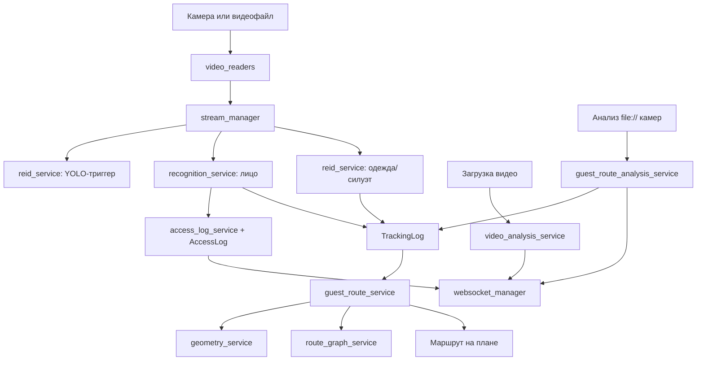

# Services: человеческая карта backend-логики

Папка `backend/app/services` — это сердце проекта. Если объяснять совсем просто:

- `api` принимает запрос от frontend.
- `models` говорят, какие таблицы есть в базе.
- `core` даёт настройки, права, безопасность и подключение к БД.
- `services` делают работу: распознают, читают видео, пишут события, строят маршруты.

## Общая схема

## Как читать эту папку

Если хочешь понять **проход через КПП**:

1. [stream_manager.md](stream_manager.md)
2. [recognition_service.md](recognition_service.md)
3. [photo_conversion.md](photo_conversion.md)
4. [access_log_service.md](access_log_service.md)
5. [websocket_manager.md](websocket_manager.md)

Если хочешь понять **как гость отслеживается внутри здания**:

1. [stream_manager.md](stream_manager.md)
2. [reid_service.md](reid_service.md)
3. [guest_route_service.md](guest_route_service.md)
4. [geometry_service.md](geometry_service.md)
5. [route_graph_service.md](route_graph_service.md)

Если хочешь понять **кнопку “Проанализировать видео и построить”**:

1. [guest_route_analysis_service.md](guest_route_analysis_service.md)
2. [reid_service.md](reid_service.md)
3. [video_readers.md](video_readers.md)
4. [guest_route_service.md](guest_route_service.md)
5. [websocket_manager.md](websocket_manager.md)

## Файлы

| Файл | По-человечески |
|---|---|
| [access_log_service.py](access_log_service.md) | Делает красивые события журнала проходов и отправляет их на frontend. |
| [geometry_service.py](geometry_service.md) | Считает геометрию на плане: точки, отрезки, полигоны, пересечения зон камер с маршрутом. |
| [guest_route_analysis_service.py](guest_route_analysis_service.md) | Offline-анализирует видео камер этажа и пишет найденные появления гостя в `TrackingLog`. |
| [guest_route_service.py](guest_route_service.md) | Строит вероятный маршрут гостя по событиям камер, зонам видимости и графу. |
| [photo_conversion.py](photo_conversion.md) | Читает фото, запускает InsightFace и получает face embedding. |
| [recognition_service.py](recognition_service.md) | Сравнивает лицо из кадра с лицами сотрудников и гостей. |
| [reid_service.py](reid_service.md) | Через YOLO и OSNet узнаёт человека по силуэту и одежде. |
| [route_graph_service.py](route_graph_service.md) | Хранит логику точек/линий маршрута и алгоритм Дейкстры. |
| [stream_manager.py](stream_manager.md) | Запускает фоновые потоки камер, берёт кадры и вызывает распознавание. |
| [video_analysis_service.py](video_analysis_service.md) | Анализирует загруженный видеофайл и сохраняет события с preview-кадрами. |
| [video_readers.py](video_readers.md) | Унифицирует чтение кадров из RTSP/file-видео через PyAV. |
| [websocket_manager.py](websocket_manager.md) | Отправляет события на frontend без постоянного polling. |

