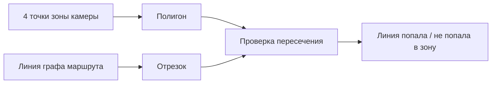

# geometry_service.py

## Для чего этот файл

Это маленькая геометрическая библиотека для плана здания. Она не знает, кто такой гость и что такое пропуск. Она умеет работать с точками, линиями и полигонами.

Самый важный вопрос, на который отвечает этот файл:

> Пересекается ли линия маршрута с зоной видимости камеры?

Это нужно для маршрута гостя. Если камера увидела человека, система берёт её 4-угольную зону и ищет, какие линии графа проходят через эту зону.

## Как это выглядит

## Как работает по шагам

1. Все координаты — это пиксели исходного изображения плана.
2. `point_in_polygon` проверяет, лежит ли точка внутри зоны камеры.
3. `segments_intersect` проверяет, пересекаются ли две линии.
4. `segment_intersects_polygon` проверяет весь отрезок относительно полигона.
5. `segment_polygon_intersection_points` находит точки входа и выхода линии из зоны.
6. `polygon_centroid` считает центр зоны.

## Главные функции

| Функция | Простое объяснение |
|---|---|
| `distance` | Считает расстояние между двумя точками. |
| `point_in_polygon` | Проверяет, находится ли точка внутри зоны камеры. |
| `segments_intersect` | Проверяет, пересеклись ли два отрезка. |
| `segment_intersects_polygon` | Проверяет, пересекает ли линия маршрута зону камеры. |
| `segment_polygon_intersection_points` | Возвращает точки пересечения линии с зоной. |
| `project_point_to_segment` | Проецирует точку на линию, то есть находит ближайшую точку на отрезке. |
| `polygon_centroid` | Считает центр 4-угольника зоны камеры. |
| `route_edge_intersects_camera_zone` | Адаптер для маршрута: берёт `RouteEdge`, его две точки и проверяет пересечение с зоной камеры. |

## Где используется

Главный потребитель — `guest_route_service.py`. Там эти функции помогают понять, какие куски графа маршрута “видит” камера.

## Важно понимать

Если маршрут не строится через нужную камеру, часто проблема не в алгоритме Дейкстры, а в геометрии: зона камеры не пересекает линию графа. Тогда `geometry_service.py` честно возвращает “пересечения нет”.

