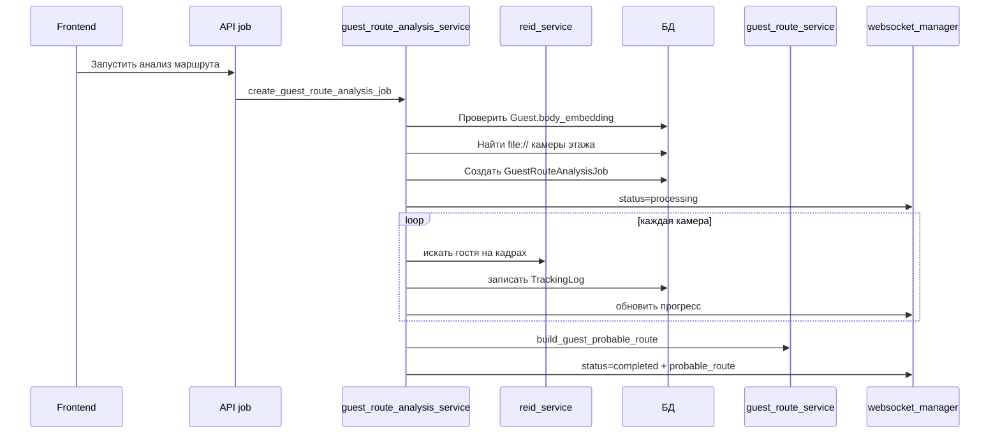

# guest_route_analysis_service.py

## Для чего этот файл

Этот сервис нужен для demo/offline сценария, когда у нас вместо реальных камер есть видеофайлы `file://`.

Кнопка “Проанализировать видео и построить” работает через этот файл.

Проще:

> Сервис берёт выбранного гостя, берёт все активные file-камеры этажа, прогоняет их видео через Re-ID/лицо, записывает найденные появления в `TrackingLog`, а потом строит маршрут обычным `guest_route_service`.

## Чем отличается от `guest_route_service`

| Сервис | Что делает |
|---|---|
| `guest_route_analysis_service` | Сначала ищет гостя на видео и пишет события в `TrackingLog`. |
| `guest_route_service` | Берёт уже готовые события и строит маршрут. |

## Схема job

## Как выбираются камеры

`get_offline_camera_sources` берёт только камеры:

- активные;
- привязанные к выбранному этажу;
- у которых `ip_address` начинается с `file://`;
- файл реально существует;
- длительность видео удалось прочитать.

Если frontend показывает `0 камер`, почти всегда проблема в одном из этих пунктов.

## Как обрабатывается одно видео

`_process_camera_video` делает так:

1. Открывает видео через OpenCV.
2. Идёт по видео с шагом `route_analysis_sample_interval_sec`.
3. На каждом выбранном кадре ищет body match выбранного гостя.
4. Если Re-ID не уверен, может попробовать подтвердить лицо.
5. Запоминает лучший кандидат или первый достаточно надёжный кадр.
6. После просмотра видео пишет один `TrackingLog` для этой камеры.

Почему один? Для маршрута важно событие “гость был на этой камере”, а не 50 одинаковых кадров подряд.

## Главные функции и классы

| Класс / функция | Простое объяснение |
|---|---|
| `GuestRouteAnalysisJob` | Модель job-статуса в БД: queued/processing/completed/failed. |
| `OfflineCameraSource` | Камера + путь к видео + длительность. |
| `TargetBodyMatch` | Результат совпадения гостя по Re-ID. |
| `TargetAppearanceCandidate` | Кандидат появления гостя на конкретной секунде видео. |
| `create_guest_route_analysis_job` | Проверяет входные условия и создаёт job. |
| `get_offline_camera_sources` | Находит file-видео камер этажа. |
| `_target_body_match` | Сравнивает силуэты на кадре с body embedding выбранного гостя. |
| `_face_confirms_guest` | Проверяет лицо как сильное подтверждение. |
| `_process_camera_video` | Главная обработка одной камеры. |
| `_run_job` | Полный цикл обработки всех камер. |
| `schedule_guest_route_analysis` | Запускает job в отдельном потоке. |
| `build_job_payload` | Собирает JSON статуса для frontend. |
| `_publish_job_update` | Отправляет прогресс через WebSocket. |

## Важно понимать

Этот сервис не должен работать вечно в HTTP-запросе. Поэтому job запускается в отдельном daemon thread, а frontend получает прогресс через WebSocket.

