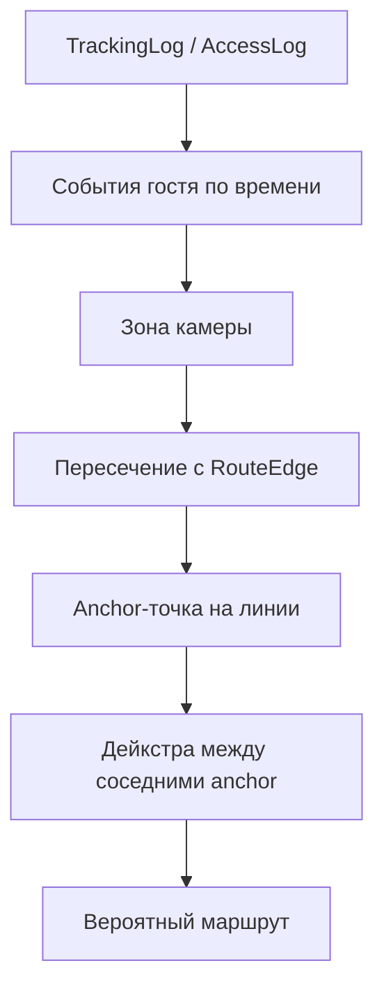
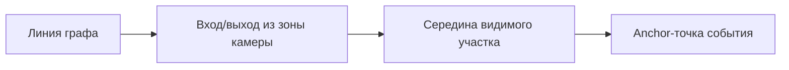

# guest_route_service.py

## Для чего этот файл

Это главный сервис построения вероятного маршрута гостя.

Он не анализирует видео и не распознаёт человека. Он берёт уже готовые события из журналов и отвечает на вопрос:

> Если гость был замечен на Camera02, потом Camera03, потом Camera05, то по каким линиям графа он скорее всего прошёл?

## Главная идея

Камера не является точкой маршрута. Камера только говорит:

> “Гость был где-то внутри моей зоны видимости”.

Поэтому маршрут строится так:

1. Берём событие камеры.
2. Берём 4-угольную зону видимости этой камеры.
3. Смотрим, какие линии графа пересекают эту зону.
4. На найденной линии выбираем виртуальную anchor-точку.
5. Между anchor-точками соседних камер строим путь по графу.

## Схема

## Как работает `build_guest_probable_route`

1. Проверяет, что гость существует.
2. Берёт события гостя из `TrackingLog`.
3. Если `TrackingLog` пустой, пробует `AccessLog`.
4. Фильтрует события по периоду `time_from/time_to`.
5. Оставляет только события камер выбранного этажа.
6. Сортирует события по timestamp.
7. Убирает слабые события ниже порога confidence.
8. Убирает подряд идущие повторы одной камеры.
9. Для каждой камеры ищет candidate-рёбра графа.
10. Вычисляет anchor-точки на пересечении зоны камеры и графа.
11. Убирает события камер, которые не пересекают граф.
12. Проверяет, что переходы между камерами физически похожи на правду.
13. Между соседними anchor-точками строит кратчайший путь.
14. Склеивает все куски в один маршрут.
15. Возвращает `events`, `route_nodes`, `route_edges`, `camera_zones`, `warnings`.

## Что такое anchor-точка

Допустим, зона камеры пересекает длинную линию коридора. Если взять просто ближайшую вершину графа, маршрут может выглядеть грубо и прыгать. Поэтому сервис выбирает точку прямо на линии внутри зоны камеры.

Это и есть anchor.

## Главные функции

| Функция | Простое объяснение |
|---|---|
| `get_camera_route_candidates` | Для одной камеры ищет линии графа, которые попали в её зону. |
| `_anchor_payload` | Создаёт anchor-точку на линии графа внутри зоны камеры. |
| `_fetch_tracking_events` | Берёт события гостя из `TrackingLog`. |
| `_fetch_access_events` | Fallback: берёт события из `AccessLog`, если трекинга нет. |
| `_filter_low_confidence_events` | Убирает слабые Re-ID события. |
| `_keep_latest_event_per_camera` | Если камера сработала несколько раз, оставляет последнее событие. |
| `_filter_plausible_event_chain` | Убирает события, которые плохо согласуются по времени/расстоянию. |
| `_find_best_anchor_path` | Ищет лучший путь между anchor-точками двух камер. |
| `build_guest_probable_route` | Собирает весь маршрут. |

## Почему появляются warnings

Warnings — это не обязательно ошибка. Это объяснение, почему маршрут построился не идеально:

- нет событий за период;
- только одна камера;
- у камеры нет зоны видимости;
- зона камеры не пересекает граф;
- между зонами нет пути;
- часть событий отброшена как слабая или неправдоподобная.

## Важно понимать

Этот сервис строит вероятный маршрут, а не точный GPS-трек. Система не знает точную координату человека внутри зоны камеры. Она строит наиболее логичный путь по размеченному графу.

