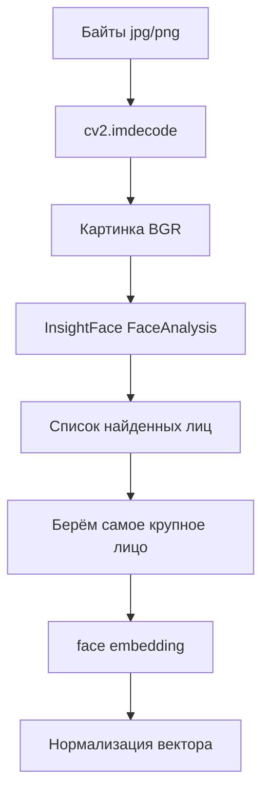

# photo_conversion.py

## Для чего этот файл

Этот сервис подготавливает фотографии и кадры для распознавания лица через InsightFace.

Когда оператор загружает фото сотрудника или гостя, backend получает обычные байты изображения. Нейросети с этим напрямую не работают. Нужно:

1. декодировать байты в картинку;
2. привести формат к OpenCV BGR;
3. найти лицо;
4. достать embedding лица;
5. нормализовать embedding.

Этим и занимается `photo_conversion.py`.

## Как работает загрузка фото лица

## Главные функции

| Функция | Простое объяснение |
|---|---|
| `_choose_providers` | Выбирает, где запускать InsightFace: CUDA если доступна, иначе CPU. |
| `_build_face_app` | Создаёт `FaceAnalysis(buffalo_l)` и готовит модель к работе. |
| `get_face_app` | Лениво создаёт и переиспользует InsightFace app. |
| `decode_image_bytes` | Превращает байты изображения в OpenCV-картинку. |
| `_get_best_face` | Если на фото несколько лиц, берёт самое крупное. |
| `extract_face_encoding_from_bgr` | Получает embedding лица из уже готового BGR-кадра. |
| `extract_face_encoding_with_bbox_from_bgr` | Возвращает embedding и координаты лица. Это нужно live-камерам. |
| `extract_face_encoding` | Главная функция для загруженного фото: bytes -> embedding. |

## Почему есть lock-и

InsightFace и ONNXRuntime могут быть не полностью безопасны при одновременном доступе из нескольких потоков. Поэтому:

- `_face_app_init_lock` защищает создание модели;
- `_face_app_infer_lock` защищает сам вызов `app.get(image_bgr)`.

Это особенно важно, потому что камеры и background jobs могут работать параллельно.

## Важно понимать

Если фото не принимается, чаще всего причина такая:

- лицо слишком маленькое;
- лицо боком;
- лицо закрыто;
- фото смазано;
- на фото нет лица;
- модель нашла не то лицо, если людей несколько.

Сервис в таком случае выбрасывает `ValueError`, а API превращает это в понятную ошибку для пользователя.

