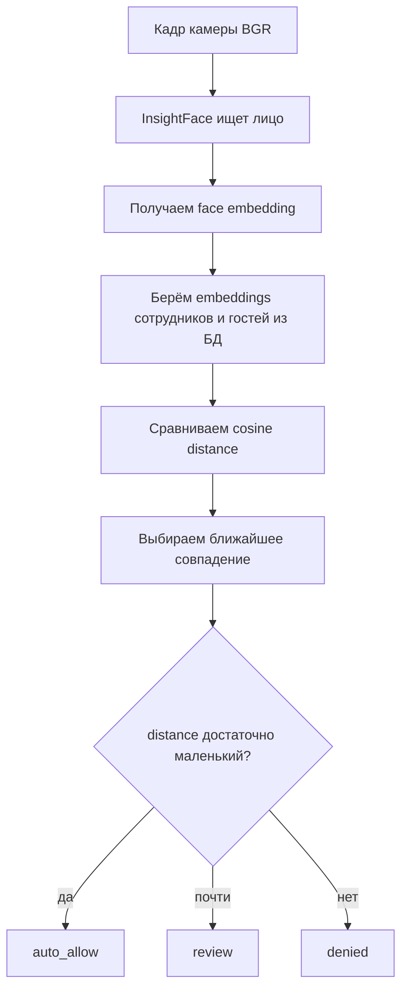

# recognition_service.py

## Для чего этот файл

Этот сервис отвечает за распознавание лица. Он получает кадр камеры, пытается найти лицо, получает embedding лица и сравнивает его с сохранёнными лицами сотрудников и гостей.

Проще:

> Камера дала кадр. Этот файл отвечает на вопрос: “Это известный человек или нет?”

## Как работает проход по лицу

## Главные понятия

| Понятие | Что значит |
|---|---|
| `embedding` | Числовой вектор лица. Не картинка, а набор признаков. |
| `cosine_distance` | Расстояние между двумя векторами. Чем меньше, тем лица похожее. |
| `auto_allow` | Система уверена, можно разрешить проход. |
| `review` | Похоже, но не достаточно уверенно. |
| `denied` | Лицо не найдено или совпадение слабое. |

## Главные функции и классы

| Функция / класс | Простое объяснение |
|---|---|
| `FaceRecognitionMatch` | Упаковывает результат: кто найден, сотрудник/гость, distance, решение, bbox лица. |
| `cosine_distance` | Считает расстояние между двумя embeddings. |
| `_find_best_match_for_vector` | Ищет самое похожее лицо среди активных сотрудников и активных гостей. |
| `_build_match` | Превращает distance в решение `auto_allow`, `review` или `denied`. |
| `find_matching_person_in_frame` | Главная функция для камеры: кадр -> лицо -> сравнение -> результат. |
| `find_matching_employee` | Похожая функция для анализа загруженного изображения/видео. Название историческое: фактически может вернуть и гостя. |

## Что считается активным гостем

Гость участвует в сравнении только если:

- `Guest.is_active == True`;
- срок `valid_until` ещё не истёк;
- у гостя есть `GuestFaceSample.embedding`.

## Где используется

- `stream_manager.py` вызывает `find_matching_person_in_frame` для live-камер.
- `video_analysis_service.py` вызывает распознавание при анализе загруженного видео.
- `guest_route_analysis_service.py` иногда использует лицо как сильное подтверждение, что Re-ID нашёл именно нужного гостя.

## Важно понимать

Этот файл не открывает турникет сам. Он только возвращает решение. Запись `AccessLog` и дальнейшие действия происходят в `stream_manager.py`.

