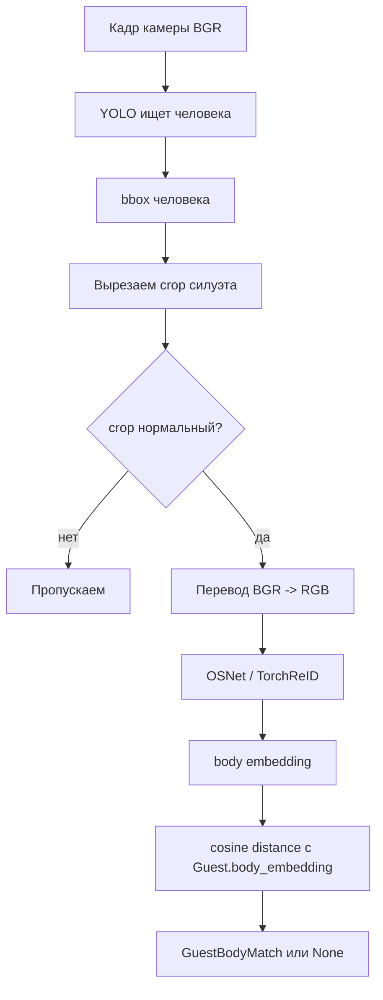

# reid_service.py

## Для чего этот файл

Этот сервис отвечает за Person Re-Identification: узнать гостя не по лицу, а по силуэту, одежде и общему внешнему виду.

Самая человеческая формулировка:

> Тут вызывается YOLO, чтобы понять, есть ли человек в кадре. Потом вырезается человек из кадра, и OSNet/TorchReID превращает этот силуэт в вектор. Этот вектор сравнивается с `Guest.body_embedding`.

Это нужно для внутренних камер, где лицо часто не видно: камера висит высоко, человек отвернулся, лицо маленькое или плохой свет.

## Общая схема

## Что происходит внутри по шагам

1. Сервис лениво импортирует `torch`, `ultralytics.YOLO` и `torchreid`.
2. Если весов YOLO/OSNet нет локально, сервис может скачать их в папку моделей.
3. YOLO ищет людей на кадре, используется класс `0` — person.
4. bbox человека обрезается по границам кадра.
5. Crop проверяется:
   - не слишком маленький;
   - не слишком смазанный;
   - не слишком обрезанный;
   - занимает достаточно площади кадра;
   - похож на тело по соотношению высоты и ширины.
6. Crop переводится из BGR в RGB, потому что OpenCV/PyAV дают BGR, а TorchReID ждёт RGB.
7. OSNet строит embedding.
8. Embedding нормализуется.
9. Embedding сравнивается с сохранёнными `Guest.body_embedding`.
10. Если distance ниже порога, считается, что гость найден.

## Главные классы

| Класс | Что означает |
|---|---|
| `BodyDetection` | Один найденный человек: bbox, уверенность YOLO, blur score и embedding. |
| `GuestBodyMatch` | Найденный гость по Re-ID: сам гость, distance, similarity и detection. |
| `PersonPresenceDetection` | Лёгкий результат YOLO-триггера: только bbox и confidence, без OSNet embedding. |

## Главные функции

| Функция | Простое объяснение |
|---|---|
| `detect_person_presence` | Быстро проверяет: есть ли человек в кадре. Это фильтр перед тяжёлым анализом. |
| `_detect_person_boxes` | Запускает YOLO и возвращает bbox людей. |
| `_validate_crop` | Отбрасывает плохие силуэты: маленькие, смазанные, обрезанные. |
| `extract_body_detections` | Главная функция “кадр -> список людей с body embedding”. |
| `extract_body_embedding_from_crop` | Делает embedding из уже вырезанного человека. |
| `extract_primary_body_embedding_from_image_bytes` | Используется при регистрации гостя по фото полного роста. |
| `match_guest_by_body` | Ищет активного гостя по одежде/силуэту на кадре. |
| `update_guest_body_embedding` | Обновляет body embedding гостя с EMA-сглаживанием. |
| `update_guest_body_embedding_from_frame` | Если лицо подтвердило гостя, находит тело рядом с лицом и обновляет embedding одежды. |

## Почему Re-ID не открывает турникет

Re-ID менее строгий, чем лицо. Одежда может быть похожей у разных людей, человек может снять куртку, освещение может поменяться. Поэтому в проекте Re-ID используется для маршрута и сопровождения по зданию, а основной допуск на КПП делается по лицу.

## Где используется

- `stream_manager.py`:
  - `detect_person_presence` используется как быстрый YOLO-триггер;
  - `match_guest_by_body` используется на внутренних камерах, если лицо не найдено;
  - `update_guest_body_embedding_from_frame` обновляет одежду гостя, если лицо уверенно распознано.
- `guest_route_analysis_service.py`:
  - offline-прогон видео ищет выбранного гостя по body embedding.
- `api/guests.py`:
  - при регистрации гостя фото полного роста превращается в `Guest.body_embedding`.

## Частые причины, почему Re-ID не нашёл гостя

- На фото полного роста нет полного тела.
- YOLO не нашёл человека.
- Crop слишком маленький или смазанный.
- Гость сменил одежду.
- Порог `reid_match_distance` слишком строгий.
- Веса YOLO/OSNet не скачаны или не инициализировались.
- Камера смотрит под слишком плохим углом.

