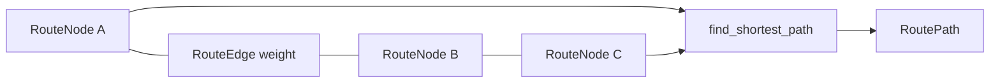

# route_graph_service.py

## Для чего этот файл

Этот сервис отвечает за ручной граф маршрутов на плане здания.

Оператор на плане ставит точки и соединяет их линиями. Для backend это граф:

- `RouteNode` — точка маршрута;
- `RouteEdge` — линия между двумя точками;
- `weight` — длина линии в пикселях плана.

Потом по этому графу можно строить кратчайший путь.

## Простая схема

## Как работает создание линии

1. Проверяется, что этаж существует.
2. Проверяется, что `from_node_id != to_node_id`.
3. Проверяется, что обе точки существуют.
4. Проверяется, что обе точки принадлежат выбранному этажу.
5. Проверяется, что такой линии ещё нет.
6. Вес линии считается как евклидово расстояние между точками.
7. Линия сохраняется в БД.

## Главные классы и функции

| Класс / функция | Простое объяснение |
|---|---|
| `RouteGraphError` | Ошибка доменной логики графа. API превращает её в HTTP-ошибку. |
| `RouteNotFoundError` | Граф нормальный, но пути между точками нет. |
| `RoutePath` | Результат маршрута: список точек, список линий, общая длина. |
| `ensure_floor_exists` | Проверяет, что этаж существует. |
| `create_route_node` | Создаёт точку маршрута. |
| `update_route_node` | Перемещает точку и пересчитывает длины связанных линий. |
| `delete_route_node` | Удаляет точку и все линии, которые к ней подключены. |
| `create_route_edge` | Создаёт линию между двумя точками. |
| `find_duplicate_edge` | Не даёт создать дубль A-B или B-A. |
| `find_shortest_path` | Реализует алгоритм Дейкстры. |

## Как работает Дейкстра

`find_shortest_path` делает так:

1. Загружает все точки и линии этажа.
2. Строит adjacency list: у каждой точки список соседей.
3. Если линия двунаправленная, добавляет путь в обе стороны.
4. Через priority queue ищет минимальную дистанцию до конечной точки.
5. Через словарь `previous` восстанавливает путь назад.
6. Возвращает `RoutePath`.

## Важно понимать

Камеры не являются точками этого графа. Граф — это “где человек может идти”. Камеры только дают события, а `guest_route_service.py` связывает события камер с этим графом.

