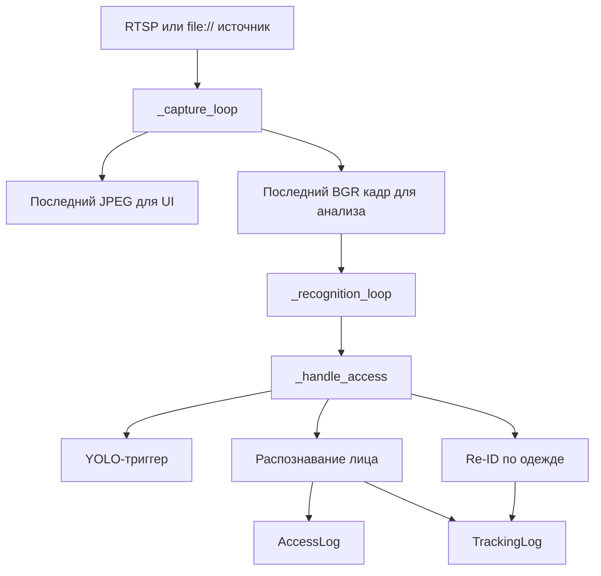

# stream_manager.py

## Для чего этот файл

Это сервис живых камер. Он запускается при старте backend и создаёт отдельный worker для каждой активной камеры.

Проще:

> Этот файл постоянно читает кадры с камер, отдаёт последний кадр в интерфейс и периодически запускает распознавание.

## Как устроен один worker камеры



## Две параллельные задачи

У `CameraStreamWorker` есть два потока:

| Поток | Что делает |
|---|---|
| `capture_thread` | Постоянно читает кадры из камеры или видеофайла, кодирует JPEG для frontend и хранит последний BGR кадр. |
| `recognition_thread` | Периодически берёт последний BGR кадр и запускает `_handle_access`. |

Так интерфейс может показывать видео, а распознавание не блокирует чтение потока.

## Что делает `_handle_access`

Это самая важная функция файла.

1. Если включён `analysis_trigger_enabled`, сначала вызывается `detect_person_presence`.
2. Если YOLO не нашёл человека, тяжёлый анализ пропускается.
3. Если человек есть, вызывается `find_matching_person_in_frame`.
4. Если лицо совпало с сотрудником или гостем и решение `auto_allow`, пишется `AccessLog(status="granted")`.
5. Если это гость на внутренней камере, дополнительно пишется `TrackingLog`.
6. Если лицо не найдено, но камера внутренняя, запускается `match_guest_by_body`.
7. Если Re-ID нашёл гостя по одежде, пишется `TrackingLog`.
8. Если лицо найдено, но человек неизвестный, пишется `AccessLog(status="denied")`.

## Почему есть cooldown

Камера видит человека не один кадр, а много кадров подряд. Без cooldown журнал был бы таким:

```text
Иванов Иван 12:00:01
Иванов Иван 12:00:02
Иванов Иван 12:00:03
...
```

Функция `_should_emit_event` не даёт писать одинаковые события слишком часто.

## Главные классы и функции

| Класс / функция | Простое объяснение |
|---|---|
| `StreamSourceConfig` | Разбирает источник камеры: live-поток или demo `file://` видео. |
| `CameraStreamWorker` | Worker одной камеры. Читает поток, хранит кадр, запускает распознавание. |
| `StreamManager` | Управляет всеми worker-ами: старт, остановка, добавление/удаление камеры. |
| `_parse_stream_source` | Понимает, что перед нами: RTSP/URL или локальный видеофайл. |
| `_encode_frame_to_jpeg` | Делает JPEG-превью для frontend. |
| `_capture_loop` | Основной цикл чтения кадров. |
| `_recognition_loop` | Основной цикл распознавания. |
| `_handle_access` | Центральная логика “кадр -> события доступа/трекинга”. |

## Где используется

- `main.py` при старте вызывает `stream_manager.start_all()`.
- API камер может добавлять/останавливать worker при изменении камеры.
- UI получает последний кадр камеры через API, который обращается к `stream_manager`.

## Важно понимать

Для `file://` видео распознавание может быть выключено по умолчанию и включаться временно. Это нужно, чтобы demo-видео не генерировали события бесконечно по кругу.

