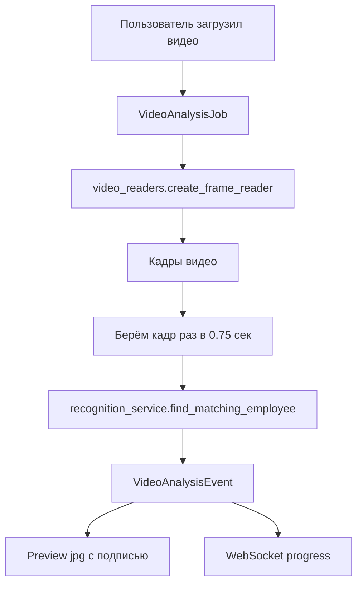

# video_analysis_service.py

## Для чего этот файл

Этот сервис анализирует загруженный видеофайл. Это отдельная функция проекта: пользователь загружает видео, backend проходит по кадрам, пытается распознать людей по лицу и сохраняет события анализа.

Не путать с `guest_route_analysis_service.py`:

- `video_analysis_service.py` анализирует **один загруженный файл** и пишет `VideoAnalysisEvent`;
- `guest_route_analysis_service.py` анализирует **file:// камеры этажа** и пишет `TrackingLog` для маршрута гостя.

## Как работает анализ видео



## Что происходит по шагам

1. API создаёт `VideoAnalysisJob` и сохраняет исходный файл.
2. `schedule_video_analysis` запускает обработку в отдельном потоке.
3. `_run_job` открывает видео через `create_frame_reader`.
4. Сервис идёт по кадрам, но анализирует не каждый кадр, а с интервалом.
5. Кадр кодируется в JPEG bytes.
6. Вызывается `find_matching_employee`.
7. Если лицо найдено и решение `auto_allow`, событие получает `status=granted`.
8. Если лицо найдено, но не совпало уверенно, событие получает `status=denied`.
9. Для события сохраняется preview-картинка с текстом.
10. Job обновляет счётчики и отправляет прогресс через WebSocket.

## Главные функции

| Функция | Простое объяснение |
|---|---|
| `build_video_analysis_job_payload` | Собирает статус job для frontend. |
| `publish_video_analysis_job_update` | Отправляет статус анализа через WebSocket. |
| `reset_video_analysis_job` | Очищает старые события и preview, чтобы перезапустить анализ. |
| `_draw_preview` | Рисует подписи на кадре: статус, имя, время. |
| `_save_event_preview` | Сохраняет preview события в `storage/video_analysis`. |
| `_build_similarity` | Делает similarity из face distance: `1 - distance`. |
| `_run_job` | Главный цикл анализа видео. |
| `schedule_video_analysis` | Запускает `_process_job` в отдельном потоке. |

## Почему есть event cooldown

Если один и тот же человек виден на видео несколько секунд, анализ может найти его много раз подряд. `event_cooldown_sec` не даёт создать слишком много одинаковых событий.

## Где хранит файлы

Preview и job-артефакты хранятся в:

```text
storage/video_analysis/job_<id>/
```

Эта папка не должна попадать в git, потому что там пользовательские/демо-видео и сгенерированные кадры.

## Важно понимать

Этот сервис полезен для отдельного анализа видеоролика, но маршрут гостя на плане строится не здесь. Для маршрута нужны `TrackingLog`, зоны камер и граф маршрутов.

