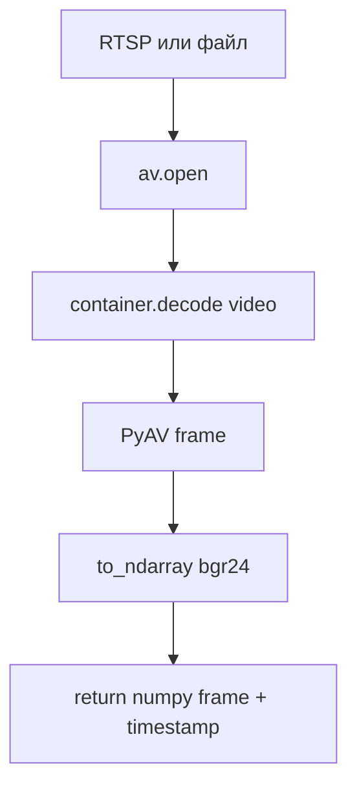

# video_readers.py

## Для чего этот файл

Этот файл делает единый интерфейс чтения кадров из видеоисточников.

Остальной backend не должен думать:

- это RTSP-поток;
- это локальный mp4;
- есть ли timestamp;
- через какую библиотеку читается видео.

Он просто вызывает:

```python
frame, timestamp = reader.read()
```

## Почему это важно

Камеры и видеофайлы используются в разных местах:

- `stream_manager.py` читает live-камеры и demo `file://` видео;
- `video_analysis_service.py` читает загруженное видео;
- offline-сценарии могут считать видео синхронными по timestamp.

`video_readers.py` прячет низкоуровневые детали PyAV.

## Как работает PyAV reader



## Live и file отличаются

| Режим | Как работает |
|---|---|
| `is_live=False` | `read()` просто берёт следующий кадр из файла. |
| `is_live=True` | Отдельный thread постоянно читает поток и держит только самый свежий кадр в queue. |

Для live-потока важно не копить старые кадры. Если камера даёт 25 fps, а анализ не успевает, лучше взять свежий кадр, чем обрабатывать очередь из прошлого.

## Главные классы и функции

| Класс / функция | Простое объяснение |
|---|---|
| `BaseFrameReader` | Базовый интерфейс: `read`, `close`, `fps`, `frame_count`. |
| `PyAVFrameReader` | Реальная реализация через PyAV. |
| `_open_container` | Открывает источник, для RTSP пробует разные параметры. |
| `_reader_thread` | Для live-режима постоянно читает поток в фоне. |
| `read` | Возвращает следующий кадр и timestamp. |
| `close` | Закрывает контейнер и освобождает ресурсы. |
| `create_frame_reader` | Фабрика, которая создаёт reader. Сейчас всегда PyAV. |

## Что возвращает reader

```python
tuple[np.ndarray, float | None] | None
```

- `np.ndarray` — кадр в формате BGR.
- `float | None` — timestamp кадра в секундах, если источник его дал.
- `None` — кадр прочитать не удалось или видео закончилось.

## Частые проблемы

- PyAV не установлен.
- В источнике нет video stream.
- RTSP недоступен.
- Кодек не поддерживается.
- Путь к `file://` видео неправильный.
- Для live-потока камера долго не отдаёт кадры.

