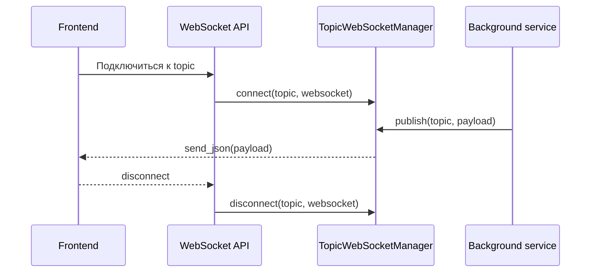

# websocket_manager.py

## Для чего этот файл

Этот файл отвечает за realtime-обновления frontend без постоянного polling.

Polling — это когда frontend каждые пару секунд спрашивает backend: “ну что, появились новые события?”. WebSocket лучше: backend сам отправляет событие, когда оно произошло.

## Какие события отправляются

В проекте используются topic-и:

| Topic | Что приходит |
|---|---|
| `access_logs` | Новое событие прохода: сотрудник, гость или неизвестное лицо. |
| `video_analysis_job:<id>` | Прогресс анализа загруженного видео. |
| `guest_route_analysis_job:<id>` | Прогресс offline-анализа маршрута гостя. |

## Как работает



## Почему `publish` устроен аккуратно

ML-задачи и камеры часто работают в отдельных потоках (`threading.Thread`). А отправлять WebSocket-сообщения нужно в event loop FastAPI.

Поэтому `publish` делает мост:

```python
asyncio.run_coroutine_threadsafe(self.broadcast(topic, message), loop)
```

То есть worker thread говорит: “отправь это сообщение”, а реальная отправка выполняется в правильном async loop.

## Главные функции и классы

| Функция / класс | Простое объяснение |
|---|---|
| `access_logs_topic` | Возвращает имя topic-а для журнала проходов. |
| `video_analysis_job_topic` | Возвращает topic конкретной задачи анализа видео. |
| `guest_route_analysis_job_topic` | Возвращает topic конкретной задачи маршрута гостя. |
| `TopicWebSocketManager` | Хранит подключения и отправляет сообщения подписчикам. |
| `connect` | Добавляет WebSocket в список подписчиков topic-а. |
| `disconnect` | Удаляет WebSocket из topic-а. |
| `broadcast` | Отправляет JSON всем подписчикам topic-а. |
| `publish` | Безопасно вызывает `broadcast` из обычного thread-а. |

## Важно понимать

Это in-process manager. Он отлично подходит для дипломного проекта и одного backend-процесса.

Если когда-нибудь backend будет запущен в нескольких процессах/контейнерах, такой manager уже не синхронизирует сообщения между ними. Тогда нужен Redis Pub/Sub, RabbitMQ, Kafka или другой брокер.

